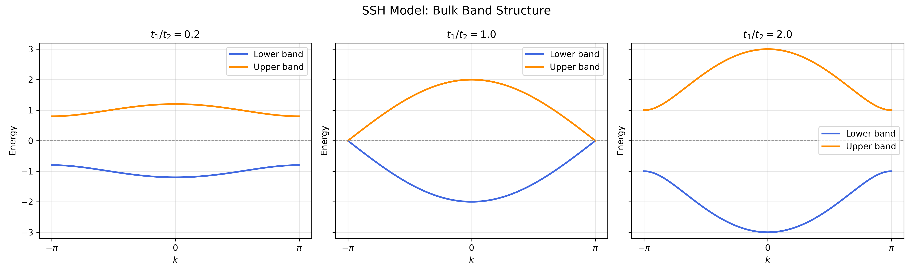
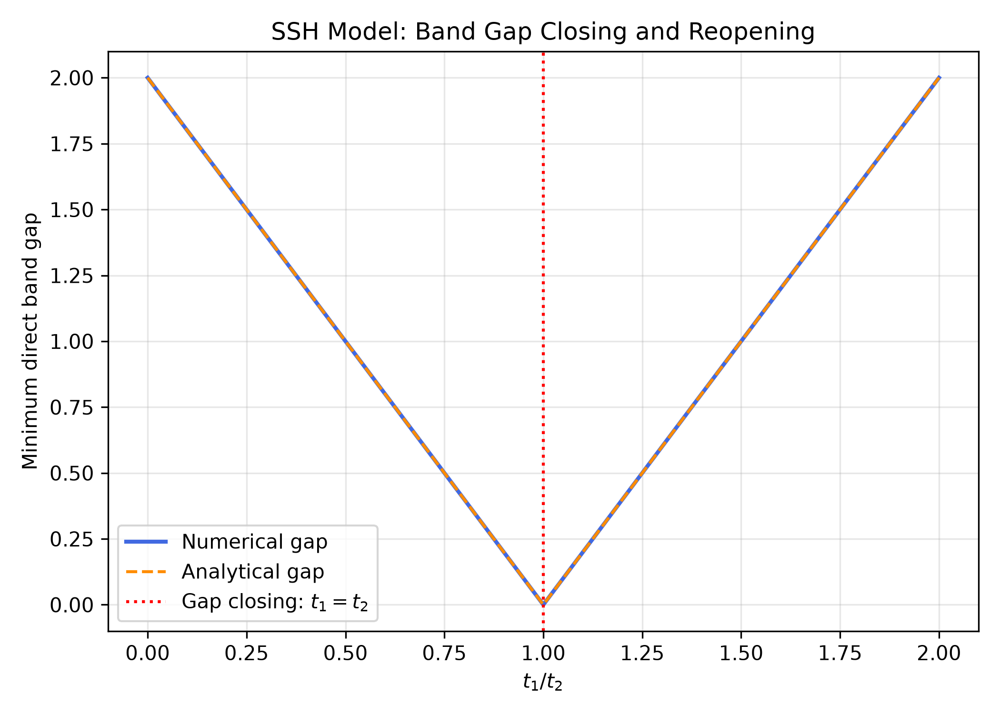

# Topological Lattice Models

A computational study of energy spectra, topological phase transitions,
and boundary states in quantum lattice models.

## Project Roadmap

1. One-dimensional tight-binding model
2. SSH model
3. Topological invariants and edge states
4. Two-dimensional Chern insulator
5. Bulk-edge correspondence

## Week 1: Finite Open Tight-Binding Chain

The first stage of this project studies a one-dimensional finite
tight-binding chain with nearest-neighbour hopping.

The Hamiltonian is

\[
H =
-t \sum_n
\left(
|n\rangle \langle n+1|
+
|n+1\rangle \langle n|
\right).
\]

For a chain of \(N\) sites with open boundary conditions, the numerical
eigenvalues obtained using NumPy agree with the analytical result

\[
E_j =
-2t
\cos
\left(
\frac{j\pi}{N+1}
\right),
\qquad
j=1,\dots,N.
\]

As the number of lattice sites increases, the allowed energy levels
become increasingly dense and approach the continuous tight-binding
dispersion relation

\[
E(k) = -2t\cos(ka).
\]

This stage verifies the connection between finite-system eigenvalues
and the bulk energy band.

## Week 2: Bloch States and Band Structure

The second stage of this project studies a one-dimensional periodic
tight-binding chain and introduces the reciprocal-space description of
the lattice.

For a periodic chain with \(N\) sites, the boundary condition

\[
\psi_{n+N} = \psi_n
\]

requires the allowed wave vectors to satisfy

\[
e^{ikNa} = 1,
\]

giving

\[
k_m =
\frac{2\pi m}{Na}.
\]

Because \(k\) and \(k+2\pi/a\) describe the same phase pattern on the
lattice, the independent wave vectors can be restricted to the first
Brillouin zone,

\[
-\frac{\pi}{a}
\leq k
<
\frac{\pi}{a}.
\]

For nearest-neighbour hopping, the periodic-chain eigenstates are
Bloch-like states of the form

\[
\psi_n \propto e^{ikna},
\]

with the dispersion relation

\[
E(k) = -2t\cos(ka).
\]

Numerical diagonalization of the periodic real-space Hamiltonian agrees
with the analytical energies evaluated at the allowed \(k\) values.

For finite \(N\), only discrete values of \(k\) are allowed. As \(N\)
increases, the spacing

\[
\Delta k =
\frac{2\pi}{Na}
\]

decreases, and the discrete energy levels become increasingly dense
along the continuous energy band.

The band extends from

\[
E_{\min}=-2t
\]

to

\[
E_{\max}=2t,
\]

giving a bandwidth

\[
W=4t.
\]

The hopping strength \(t\) controls the energy width of the band, while
the lattice spacing \(a\) determines the width of the first Brillouin
zone in reciprocal space.

## Week 3: SSH Bulk Band Structure and Gap Closing

The third stage extends the one-dimensional tight-binding model to the
Su–Schrieffer–Heeger (SSH) model, in which nearest-neighbour hopping
amplitudes alternate between two values.

Each unit cell contains two sublattice sites, A and B. The intracell
hopping amplitude is denoted by \(t_1\), while \(t_2\) describes
intercell hopping between adjacent unit cells.

The real-space Hamiltonian is

\[
H =
-\sum_n
\left(
t_1 |n,A\rangle\langle n,B|
+
t_2 |n+1,A\rangle\langle n,B|
+
\mathrm{h.c.}
\right).
\]

Using periodic boundary conditions and a unit-cell lattice constant
\(a=1\), the Bloch Hamiltonian in the basis
\((|k,A\rangle,|k,B\rangle)\) is

\[
H(k) =
-
\begin{pmatrix}
0 & t_1+t_2e^{-ik}\\
t_1+t_2e^{ik} & 0
\end{pmatrix}.
\]

The two-dimensional Bloch Hamiltonian produces two energy bands,

\[
E_{\pm}(k)
=
\pm
\sqrt{
t_1^2+t_2^2+2t_1t_2\cos k
}.
\]

The band structure was calculated numerically by diagonalizing
\(H(k)\) over the first Brillouin zone.

Three hopping ratios were investigated,

\[
\frac{t_1}{t_2}
=
0.2,\ 1.0,\ 2.0,
\]

with \(t_2=1\).

The two bands remain separated when \(t_1\neq t_2\), while they
touch at \(k=\pi\) when \(t_1=t_2\).

The direct band gap at each wave vector is defined by

\[
\Delta E(k)
=
E_+(k)-E_-(k).
\]

For positive hopping amplitudes, the minimum direct band gap occurs
at \(k=\pi\), giving

\[
\Delta_{\min}
=
2|t_1-t_2|.
\]

The gap therefore closes when

\[
t_1=t_2,
\]

and reopens as the hopping ratio moves away from this critical value.

Numerical calculations of the minimum band gap were compared with
the analytical expression.

The numerical and analytical gap curves agree within floating-point
precision. The Hermiticity of the Bloch Hamiltonian was also verified,
and numerical eigenvalues agree with the analytical dispersion
relation to approximately \(10^{-15}\).

These results demonstrate how alternating hopping amplitudes modify
the bulk energy spectrum and produce a band-gap closing and reopening.

The distinction between the two gapped regimes will be investigated
further through topological invariants and boundary-localized states
in the next stage of the project.

## Current Status

Week 1 completed:
- constructed finite open-chain Hamiltonians
- numerically diagonalized Hermitian Hamiltonians
- verified eigenvalues and eigenvectors
- compared numerical and analytical spectra
- visualized the finite-size approach to the energy band

Week 2 completed:
- constructed finite periodic-chain Hamiltonians
- derived the allowed \(k\) values from periodic boundary conditions
- identified the first Brillouin zone
- verified numerical and analytical periodic-chain energies
- plotted the one-dimensional tight-binding band structure
- visualized finite-\(N\) states on the continuous energy band
- studied the effects of hopping strength and lattice spacing

Week 3 completed:
- constructed the SSH Bloch Hamiltonian with alternating hopping amplitudes
- derived the analytical bulk energy bands
- numerically diagonalized the \(2\times2\) Bloch Hamiltonian
- compared band structures for three hopping ratios
- calculated the minimum direct band gap across the parameter range
- demonstrated band-gap closing and reopening at \(t_1=t_2\)
- verified Hermiticity and agreement between numerical and analytical results
- generated SSH bulk band-structure and band-gap figures