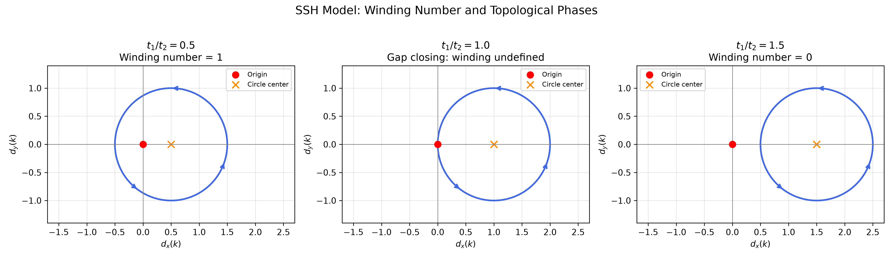
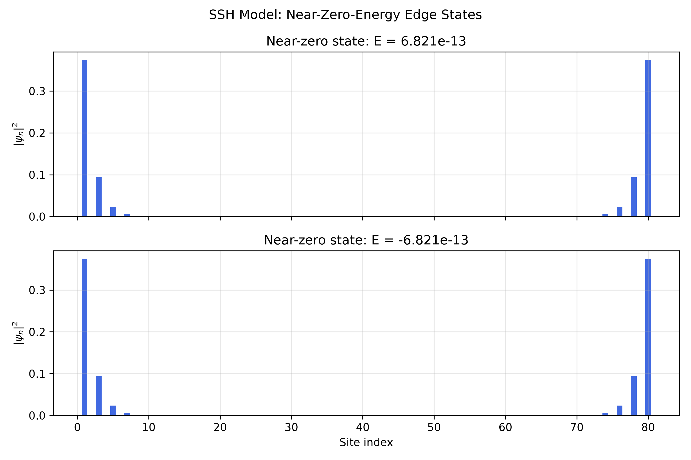
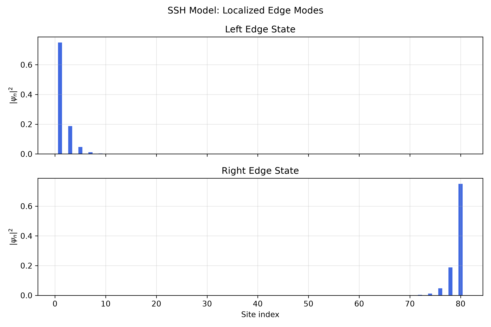
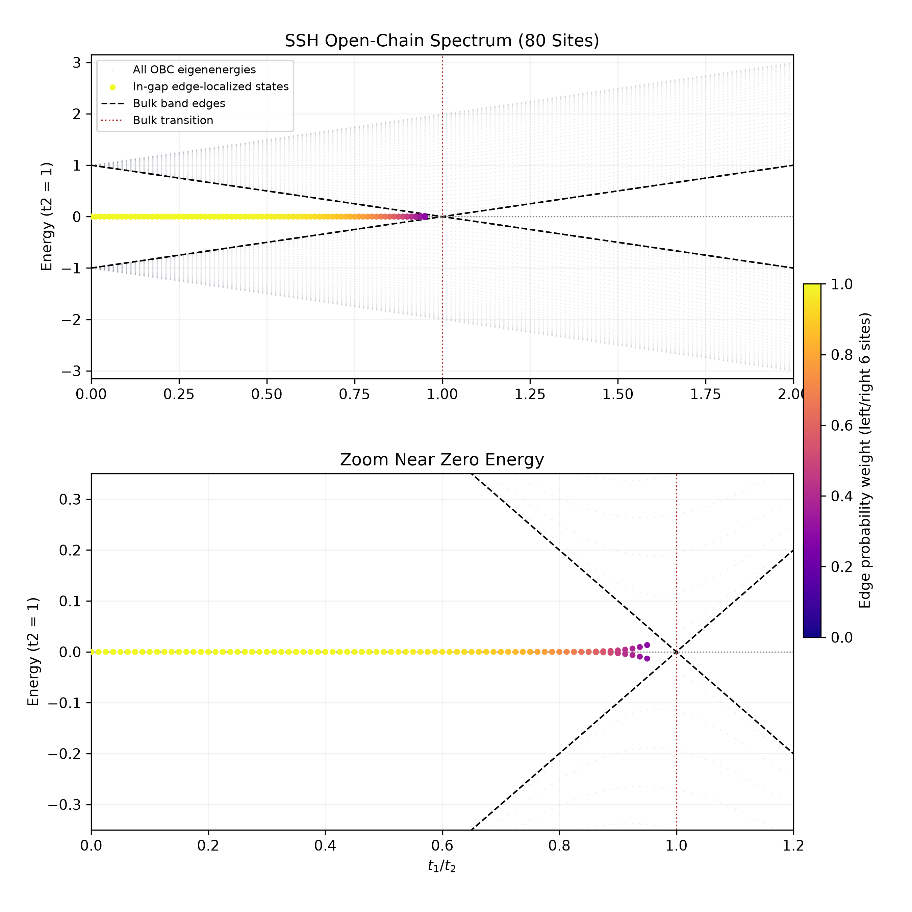

# Topological Lattice Models

A computational study of energy spectra, topological phase transitions, and boundary states in quantum lattice models.

## Project Overview

This project investigates how the hopping structure and boundary conditions of quantum lattice Hamiltonians influence their energy spectra, band gaps, and topological properties.

Using analytical derivations and numerical diagonalization in Python, the study begins with one-dimensional tight-binding chains, extends to the Su–Schrieffer–Heeger (SSH) model, and explores the relationship between bulk topological invariants and boundary-localized states.

The project will subsequently extend these ideas to two-dimensional Chern insulators.

## Project Roadmap

1. One-dimensional tight-binding model
2. Bloch states and band structure
3. SSH model and band-gap closing
4. Topological invariants and edge states
5. Two-dimensional Chern insulator
6. Berry curvature and Chern number
7. Bulk-edge correspondence

## Week 1: Finite Open Tight-Binding Chain

The first stage of this project studies a one-dimensional finite tight-binding chain with nearest-neighbour hopping.

The Hamiltonian is

$$
H=-t\sum_n\left(|n\rangle\langle n+1|+|n+1\rangle\langle n|\right).
$$

For a chain of $N$ sites with open boundary conditions, the numerical eigenvalues obtained using NumPy agree with the analytical result

$$
E_j=-2t\cos\left(\frac{j\pi}{N+1}\right),
\qquad j=1,\ldots,N.
$$

As the number of lattice sites increases, the allowed energy levels become increasingly dense and approach the continuous tight-binding dispersion relation

$$
E(k)=-2t\cos(ka).
$$

This stage verifies the connection between finite-system eigenvalues and the bulk energy band.

## Week 2: Bloch States and Band Structure

The second stage studies a one-dimensional periodic tight-binding chain and introduces the reciprocal-space description of the lattice.

For a periodic chain with $N$ sites, the boundary condition

$$
\psi_{n+N}=\psi_n
$$

requires the allowed wave vectors to satisfy

$$
e^{ikNa}=1,
$$

giving

$$
k_m=\frac{2\pi m}{Na}.
$$

Because $k$ and $k+2\pi/a$ describe the same phase pattern on the lattice, the independent wave vectors can be restricted to the first Brillouin zone,

$$
-\frac{\pi}{a}\leq k<\frac{\pi}{a}.
$$

For nearest-neighbour hopping, the periodic-chain eigenstates are Bloch-like states of the form

$$
\psi_n\propto e^{ikna},
$$

with dispersion relation

$$
E(k)=-2t\cos(ka).
$$

Numerical diagonalization of the periodic real-space Hamiltonian agrees with the analytical energies evaluated at the allowed $k$ values.

For finite $N$, only discrete values of $k$ are allowed. As $N$ increases, the spacing

$$
\Delta k=\frac{2\pi}{Na}
$$

decreases, and the discrete energy levels become increasingly dense along the continuous energy band.

For positive hopping strength $t$, the band extends from

$$
E_{\min}=-2t
$$

to

$$
E_{\max}=2t,
$$

giving a bandwidth

$$
W=4t.
$$

The hopping strength $t$ controls the energy width of the band, while the lattice spacing $a$ determines the width of the first Brillouin zone in reciprocal space.

## Week 3: SSH Bulk Band Structure and Gap Closing

The third stage extends the one-dimensional tight-binding model to the Su–Schrieffer–Heeger (SSH) model, in which nearest-neighbour hopping amplitudes alternate between two values.

Each unit cell contains two sublattice sites, A and B. The intracell hopping amplitude is denoted by $t_1$, while $t_2$ describes intercell hopping between adjacent unit cells.

The real-space Hamiltonian is

$$
H=-\sum_n\left(t_1|n,A\rangle\langle n,B|+t_2|n+1,A\rangle\langle n,B|+\mathrm{h.c.}\right).
$$

Using periodic boundary conditions and a unit-cell lattice constant $a=1$, the Bloch Hamiltonian in the basis $(|k,A\rangle,|k,B\rangle)$ is

$$
H(k)=-
\begin{pmatrix}
0&t_1+t_2e^{-ik}\\
t_1+t_2e^{ik}&0
\end{pmatrix}.
$$

The two-dimensional Bloch Hamiltonian produces two energy bands,

$$
E_\pm(k)=\pm\sqrt{t_1^2+t_2^2+2t_1t_2\cos k}.
$$

The band structure was calculated numerically by diagonalizing $H(k)$ over the first Brillouin zone.

Three hopping ratios were investigated,

$$
\frac{t_1}{t_2}=0.2,\ 1.0,\ 2.0,
$$

with $t_2=1$.

The two bands remain separated when $t_1\neq t_2$, while they touch at $k=\pi$ when $t_1=t_2$.

The direct band gap at each wave vector is defined by

$$
\Delta E(k)=E_+(k)-E_-(k).
$$

For positive hopping amplitudes, the minimum direct band gap occurs at $k=\pi$, giving

$$
\Delta_{\min}=2|t_1-t_2|.
$$

The gap therefore closes when

$$
t_1=t_2,
$$

and reopens as the hopping ratio moves away from this critical value.

Numerical calculations of the minimum band gap were compared with the analytical expression.

The numerical and analytical gap curves agree within floating-point precision. The Hermiticity of the Bloch Hamiltonian was also verified, and numerical eigenvalues agree with the analytical dispersion relation to approximately $10^{-15}$.

These results demonstrate how alternating hopping amplitudes modify the bulk energy spectrum and produce a band-gap closing and reopening.

However, the band gap alone does not distinguish the two gapped phases. Their topological properties are investigated in the next stage.

## Week 4: SSH Topology and Edge States

The fourth stage investigates the topological distinction between the two gapped phases of the SSH model.

The main objective is to establish a connection between the bulk winding number, boundary-localized states, and the finite-size energy spectrum.

### 4.1 Bulk Winding Number

The SSH Bloch Hamiltonian can be expressed using Pauli matrices as

$$
H(k)=d_x(k)\sigma_x+d_y(k)\sigma_y,
$$

where, for the negative-hopping convention used in this project,

$$
d_x(k)=-(t_1+t_2\cos k),
$$

$$
d_y(k)=-t_2\sin k.
$$

Equivalently, define the complex function

$$
q(k)=t_1+t_2e^{ik}.
$$

As $k$ traverses the first Brillouin zone, $q(k)$ traces a circle in the complex plane.

The circle has center $(t_1,0)$ and radius $|t_2|$.

The winding number measures how many times this closed trajectory winds around the origin:

$$
\nu=\frac{1}{2\pi}\int_{-\pi}^{\pi}\frac{d\theta(k)}{dk}\,dk,
$$

where

$$
\theta(k)=\arg[q(k)].
$$

For positive hopping amplitudes, the winding number is

$$
\nu=
\begin{cases}
1,&t_1<t_2,\\
0,&t_1>t_2.
\end{cases}
$$

When $t_1=t_2$, the trajectory passes through the origin, the bulk energy gap closes, and the winding number is undefined.

The winding number was calculated numerically using phase unwrapping to obtain the accumulated phase change over the Brillouin zone.

The numerical calculations reproduce the expected winding numbers for the trivial and topological phases.

The results demonstrate that the winding number cannot change continuously while the bulk gap remains open and the protecting chiral symmetry is preserved.

### 4.2 Open-Chain Edge States

To investigate the boundary properties of the SSH model, a finite chain with open boundary conditions was constructed.

For $N$ unit cells, the Hamiltonian contains $2N$ lattice sites, with alternating intracell and intercell hopping amplitudes.

Numerical calculations were performed using $N=40$, corresponding to an 80-site chain.

The eigenvalue problem is

$$
H|\psi\rangle=E|\psi\rangle.
$$

For $t_1<t_2$, two eigenstates with energies close to zero were identified.

Their probability distributions,

$$
P(n)=|\psi_n|^2,
$$

are strongly concentrated near the boundaries of the chain.

To distinguish the left- and right-localized modes, the position operator was projected onto the two-dimensional near-zero-energy subspace.

Diagonalizing the projected position operator produces states localized predominantly at opposite boundaries.

For $t_1=0.5$ and $t_2=1$, the numerical expectation values of the position operator were

$$
\langle X\rangle_L=1.6667,
$$

$$
\langle X\rangle_R=79.3333.
$$

Both states were numerically normalized to unity.

These results agree with the exponential localization predicted by the SSH model.

For a semi-infinite chain, the left-edge zero-energy mode satisfies

$$
a_n=\left(-\frac{t_1}{t_2}\right)^{n-1}a_1.
$$

Therefore,

$$
|a_n|^2\propto\left|\frac{t_1}{t_2}\right|^{2(n-1)}.
$$

When $|t_1|<|t_2|$, the probability density decays exponentially away from the boundary.

The corresponding localization length, measured in unit cells, is

$$
\xi=\frac{1}{\ln|t_2/t_1|}.
$$

As $t_1/t_2$ approaches 1 from below, the localization length increases, and the edge modes become less strongly confined to the boundaries.

### 4.3 Finite-Size Energy Splitting

For a finite SSH chain, the left- and right-localized modes can interact through the hopping terms of the Hamiltonian.

Consequently, the two near-zero-energy eigenstates generally have small but nonzero energies.

The approximate localized modes can be written as

$$
|L\rangle=C\sum_{n=1}^{N}r^{n-1}|A_n\rangle,
$$

$$
|R\rangle=C\sum_{n=1}^{N}r^{N-n}|B_n\rangle,
$$

where

$$
r=-\frac{t_1}{t_2}
$$

and the normalization factor satisfies

$$
C^2=\frac{1-r^2}{1-r^{2N}}.
$$

The effective coupling between the localized modes is

$$
\delta=\langle L|H|R\rangle=-C^2t_1r^{N-1}.
$$

Projecting the Hamiltonian onto the subspace spanned by these two modes gives

$$
H_{\mathrm{eff}}=
\begin{pmatrix}
0&\delta\\
\delta^*&0
\end{pmatrix}.
$$

The eigenvalues of this effective Hamiltonian are

$$
E_\pm=\pm|\delta|.
$$

For positive hopping amplitudes and $\rho=t_1/t_2<1$, the approximate near-zero eigenenergies are therefore

$$
\boxed{
|E_\pm|\approx
t_2\frac{(1-\rho^2)\rho^N}{1-\rho^{2N}}
}
$$

and the energy splitting is

$$
\Delta E=E_+-E_-\approx2|\delta|.
$$

The expression predicts exponentially small energy splitting as the chain length increases at fixed $\rho<1$.

To verify this result, the effective-theory approximation was compared with eigenvalues obtained from direct numerical diagonalization of the finite SSH Hamiltonian.

For $N=40$ and $t_2=1$, the results were:

| $t_1/t_2$ | Numerical $|E|$ | Approximate $|E|$ | Relative Error |
|---|---|---|---|
| 0.5 | 6.820308e-13 | 6.821210e-13 | 0.0132% |
| 0.7 | 3.247071e-07 | 3.247071e-07 | 9.143e-8% |
| 0.8 | 4.785222e-05 | 4.785221e-05 | 0.0000225% |
| 0.9 | 2.812550e-03 | 2.808981e-03 | 0.1270% |

The numerical results closely agree with the effective-theory prediction.

For very small energies, floating-point precision affects the relative error. As the hopping ratio approaches the transition point, the localized-mode approximation becomes less accurate because the edge states extend further into the bulk.

This comparison provides an independent analytical validation of the numerical edge-state calculations.

### 4.4 OBC Energy Spectrum and Edge Localization

The finite-chain energy spectrum was investigated as a function of the hopping ratio $t_1/t_2$.

For each parameter value, the 80-site open-chain Hamiltonian was diagonalized to obtain its eigenvalues and eigenvectors.

To quantify the spatial localization of each eigenstate, an edge probability weight was defined as

$$
P_{\mathrm{edge}}=
\sum_{n=1}^{m}|\psi_n|^2+
\sum_{n=2N-m+1}^{2N}|\psi_n|^2,
$$

where $m=6$ is the number of sites included near each boundary.

A high value of $P_{\mathrm{edge}}$ indicates that a large fraction of the state's probability density is concentrated near the boundaries.

The open-chain energy spectrum was plotted together with this localization measure.

In the topological regime $t_1<t_2$, two near-zero-energy states appear inside the bulk energy gap and exhibit strong edge localization.

As $t_1/t_2$ approaches 1, their localization weakens and the finite-size energy splitting becomes more pronounced.

At the bulk transition point $t_1=t_2$, the infinite periodic system becomes gapless. The finite open chain retains discrete energy levels because of its finite size.

In the trivial regime $t_1>t_2$, the standard open SSH chain does not exhibit the corresponding topologically protected near-zero-energy edge modes.

The edge probability weight is a numerical localization diagnostic rather than a topological invariant. Its threshold is used only to highlight strongly localized states in the figure.

### 4.5 Bulk-Boundary Correspondence

The combined bulk and open-chain calculations demonstrate the correspondence between the SSH winding number and boundary-localized modes.

For the unit-cell convention and open-chain termination adopted in this project,

$$
\nu=1
\quad\Longleftrightarrow\quad
|t_1|<|t_2|,
$$

which corresponds to the regime supporting topological boundary modes.

By contrast,

$$
\nu=0
\quad\Longleftrightarrow\quad
|t_1|>|t_2|
$$

for positive hopping amplitudes, and the standard termination does not support the corresponding protected zero-energy edge modes.

The SSH Hamiltonian possesses chiral symmetry,

$$
\Gamma H\Gamma^{-1}=-H,
$$

which constrains nonzero energy eigenvalues to occur in positive-negative pairs.

For finite chains, the two boundary modes may hybridize, producing exponentially small nonzero energies without breaking chiral symmetry.

Therefore, the observation of $E\approx0$ alone is insufficient to establish a topological phase. The interpretation must also consider the bulk winding number, chiral symmetry, boundary conditions, and spatial localization of the eigenstates.

These numerical and analytical results provide a concrete demonstration of one-dimensional bulk-boundary correspondence.

## Numerical Methods

The calculations use Python, NumPy, and Matplotlib.

The principal numerical methods include:

- Construction of finite real-space tight-binding Hamiltonians.
- Diagonalization of Hermitian matrices using `numpy.linalg.eigh` and `numpy.linalg.eigvalsh`.
- Sampling and diagonalization of Bloch Hamiltonians over the Brillouin zone.
- Comparison between analytical and numerical energy spectra.
- Numerical calculation of winding numbers using phase unwrapping.
- Identification of edge-localized states through probability distributions and projected position operators.
- Parameter scans of open-chain spectra and edge probability weights.
- Comparison between finite-size numerical eigenvalues and effective-theory predictions.

Numerical results were checked against analytical expressions, Hermiticity conditions, eigenstate normalization, and finite-size behavior where applicable.

## Current Status

### Week 1 — Completed

- Constructed finite open-chain Hamiltonians.
- Numerically diagonalized Hermitian Hamiltonians.
- Verified eigenvalues and eigenvectors.
- Compared numerical and analytical spectra.
- Visualized the finite-size approach to the energy band.

### Week 2 — Completed

- Constructed finite periodic-chain Hamiltonians.
- Derived allowed wave vectors from periodic boundary conditions.
- Identified the first Brillouin zone.
- Verified numerical and analytical periodic-chain energies.
- Plotted the one-dimensional tight-binding band structure.
- Visualized finite-$N$ states on the continuous energy band.
- Studied the effects of hopping strength and lattice spacing.

### Week 3 — Completed

- Constructed the SSH Bloch Hamiltonian with alternating hopping amplitudes.
- Derived the analytical bulk energy bands.
- Numerically diagonalized the $2\times2$ Bloch Hamiltonian.
- Compared band structures for three hopping ratios.
- Calculated the minimum direct band gap across the parameter range.
- Demonstrated band-gap closing and reopening at $t_1=t_2$.
- Verified Hermiticity and agreement between numerical and analytical results.
- Generated SSH bulk band-structure and band-gap figures.

### Week 4 — Completed

- Expressed the SSH Bloch Hamiltonian using Pauli matrices.
- Calculated winding numbers in trivial and topological regimes.
- Visualized winding trajectories in the complex plane.
- Constructed finite open-chain SSH Hamiltonians.
- Identified near-zero-energy eigenstates.
- Calculated and visualized edge-state probability distributions.
- Constructed left- and right-localized modes using the projected position operator.
- Derived an effective Hamiltonian for finite-size edge-mode coupling.
- Compared approximate edge-state energy splitting with numerical eigenvalues.
- Visualized the open-chain energy spectrum and edge probability weights.
- Investigated the relationship between bulk topology and boundary-localized states.

### Upcoming Stages

**Week 5 — Two-Dimensional Chern Insulator**

Construct a two-dimensional two-band Hamiltonian, calculate bulk energy surfaces, and investigate gap-closing conditions.

**Week 6 — Berry Curvature and Chern Number**

Numerically calculate Berry curvature and Chern numbers to distinguish two-dimensional topological phases.

**Week 7 — Bulk-Edge Correspondence**

Construct a strip Hamiltonian and investigate chiral edge modes in a two-dimensional topological system.

**Week 8 — Final Documentation and Report**

Complete numerical verification, organize project figures, and prepare a short research report summarizing the models, methods, results, and physical interpretation.